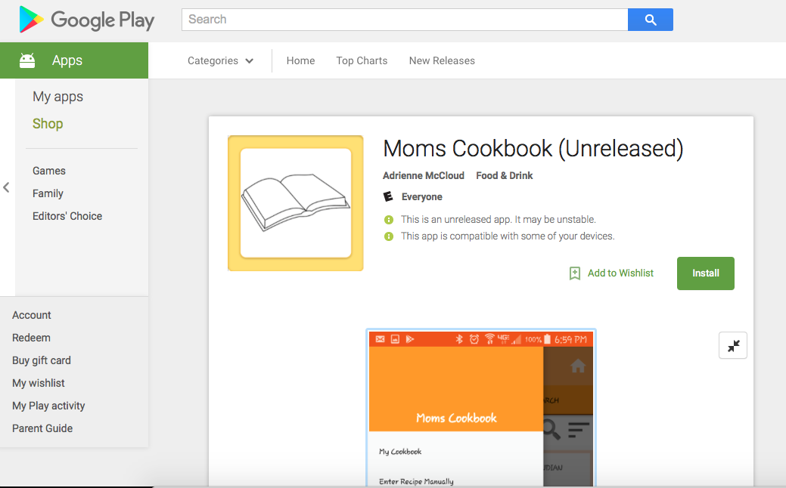
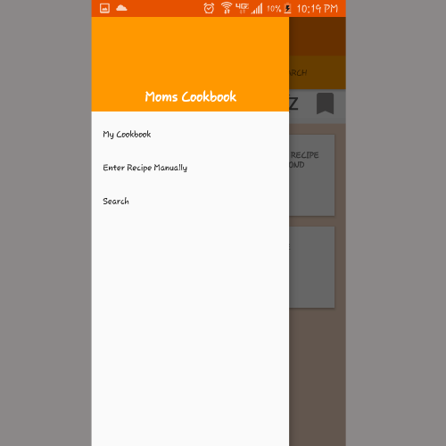
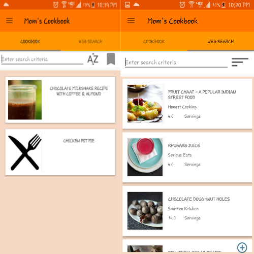
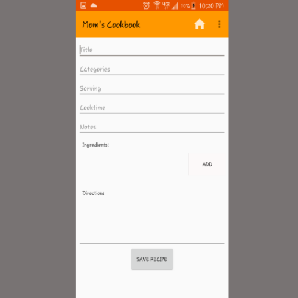
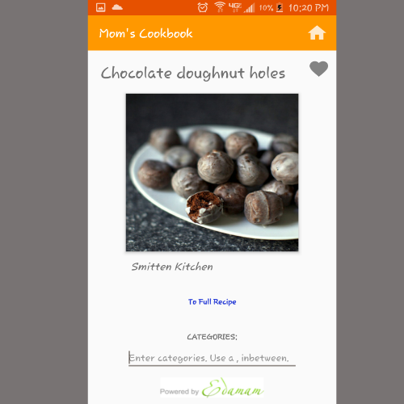

# moms_cookbook
Cookbook app. Store and find recipes with this app and before you know it, it will feel like your mom's cookbook.

Web Search
The app allows the user to search through an API, view basic information about the recipe, and then click to a full view of the website within the app. 

Manually Enter
The user is able to enter a recipe manually. 

Link for Google Play Store: 
https://play.google.com/store/apps/details?id=com.adrienne.cookbook_app

User stories

User is able to search through an API. 
User is able to save basic information from an API to thier cookbook. 
User is able to enter a recipe manually.
User is able to view all recipes from thier collection in the cookbook(home screen). 
User can delete a recipe from the database. 
User can add a bookmark to a recipe. 
User can see the website source from the API search in the app. 
User can arrange title of recipes in alphabetical order (from A-Z).
User can edit recipes saved in thier cookbook. 
